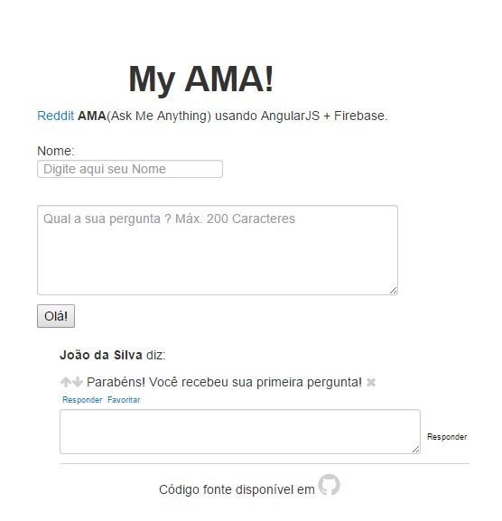

# MyAMA
Reddit AMA(Ask Me Anything) usando AngularJS + Firebase

#Todo

- Evento de clique em "responder" e "favorito" abrindo box de comentários
- Login com Twitter ou Google
<s>- Integração app -> firebase</s>
- Ordem de posts com mais UP
- Melhorar layout do código
