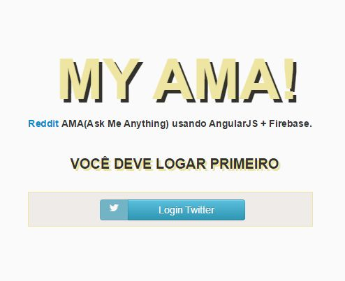
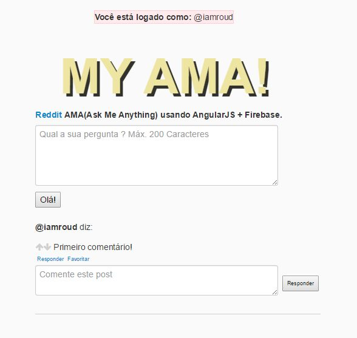

# MyAMA
Reddit AMA(Ask Me Anything) usando AngularJS + Firebase

 

#Todo

- Separar posts do usuario que fez login.
- Evento de clique em "responder" e "favorito" abrindo box de comentários
- Excluir Posts(firebase) 
<s>- Login com Twitter</s> 
-<s> Integração app -> firebase</s>
- Ordem de posts com mais UP
- Melhorar layout do código
